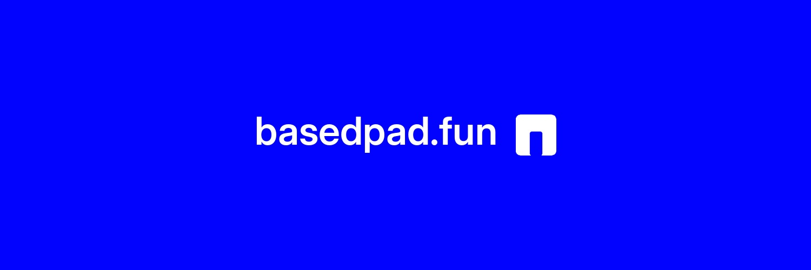
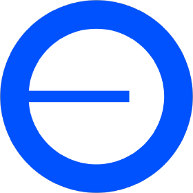
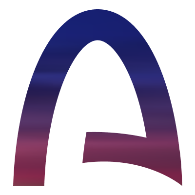
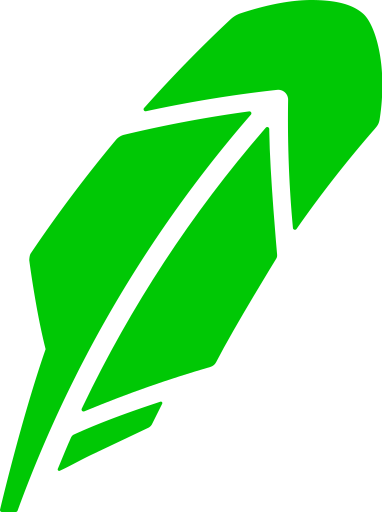

  

<h1 align="center">
  
  BasedPad — launch where the market should trade
</h1>

  <a href="https://basedpad.fun">basedpad.fun</a> ·
  <a href="https://x.com/basedpadfun">@basedpadfun</a> ·
  <a href="PARTNER-API.md">Partner API</a> ·
  <a href="DEVELOPERS.md">Developer notes</a>

   &nbsp;
   &nbsp;
   &nbsp;
  

BasedPad is a multi-chain launchpad where every launch is a **real Uniswap market from block one**: a fixed 1B supply seeded single-sided into a canonical pool against a curated quote asset, opening at $3,000 FDV, graduating at $9,000, with the pool's 1% LP fee split 90% to the creator and 10% to the platform. No bonding curve, no migration, no app swap fee.

## Modules

| Module | Chain | Pairs |
| --- | --- | --- |
| **Global V9** | Base | official Coinbase tokenized stocks (B20) and curated crypto quotes |
| **Arc Markets** | Arc | USDC and curated Arc memes |
| **Robinhood Markets** | Robinhood Chain | ETH, USDG and curated Robinhood memes; settled in native ETH |
| **BON/DEX** | Robinhood Chain | the $BONS treasury, the DEX view and the **lineage**: chained markets where each generation is quoted in the one before it |
| **HyperEVM** | HyperEVM | WHYPE on HyperSwap v3 |

One explorer lists everything across chains, ranked by market cap: https://basedpad.fun

## For integrators

- **REST:** `GET https://basedpad.fun/api/v1/tokens?chain=all` — every launch, newest first, with live market data. No key, CORS open. See [PARTNER-API.md](PARTNER-API.md).
- **On-chain:** factory addresses, launch events and read functions per chain in [DEVELOPERS.md](DEVELOPERS.md); ABIs in [`abi/`](abi/).
- **Identity:** `GET https://basedpad.fun/api/v1` returns logos, chains, factories and event signatures for listing BasedPad as a launchpad source.

## Brand

Assets in [`brand/`](brand/): `launchpad-512.png`, `launchpad-256.png`, `launchpad-badge-256.png`, `launchpad-badge-64.png`, `banner-1500x500.jpg`, `banner-1200.jpg`, chain marks in `brand/chains/`. Use them unmodified when referencing BasedPad.

## License

Documentation and ABIs in this repository: MIT. Contracts are deployed on-chain at the addresses listed above; verified source is available on each chain's explorer.
